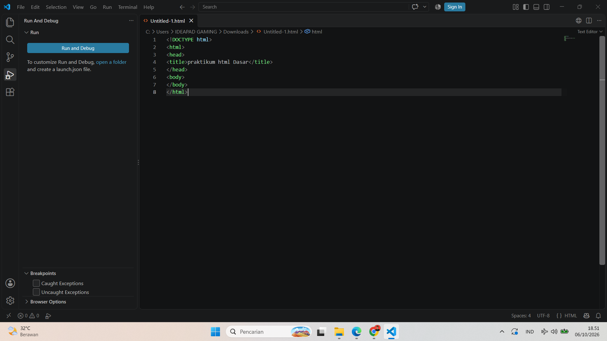
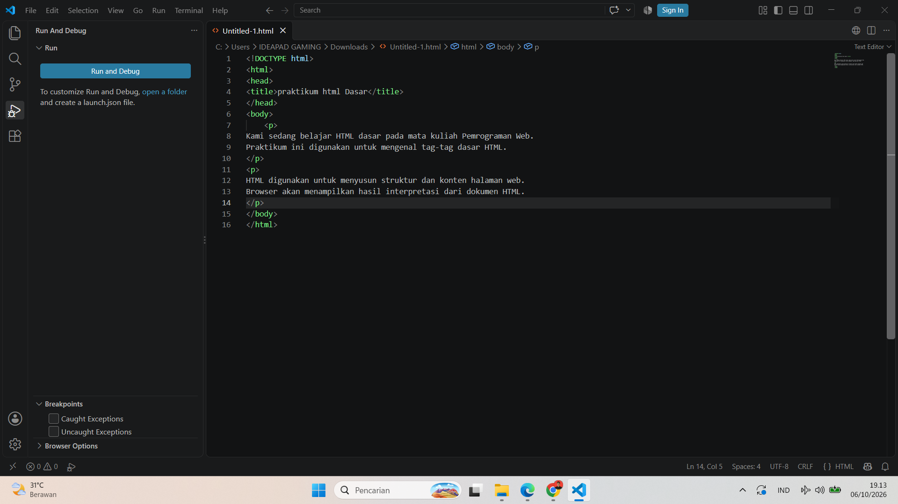
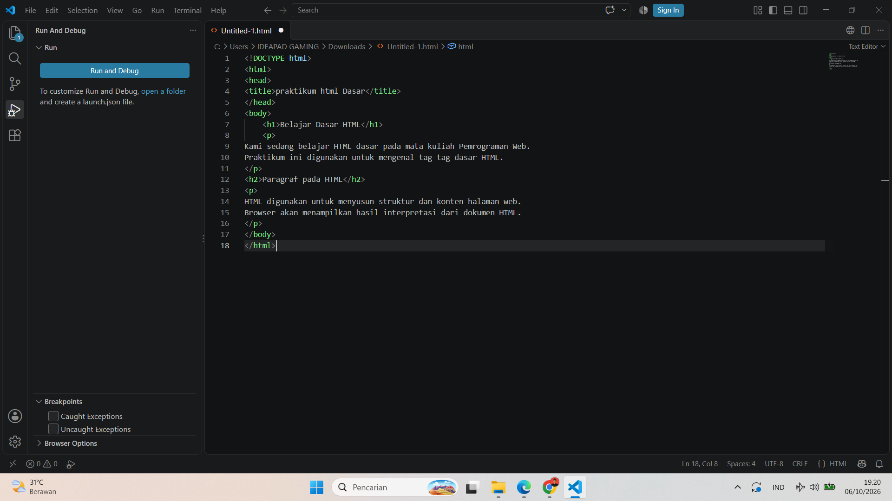
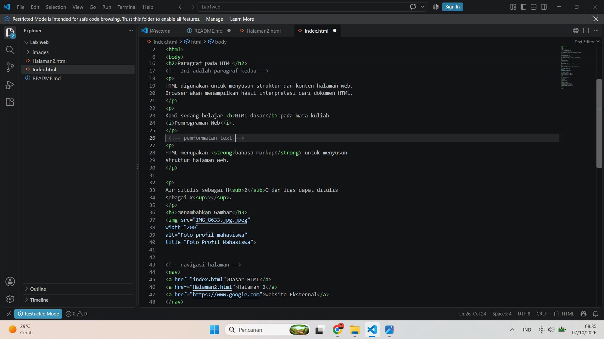
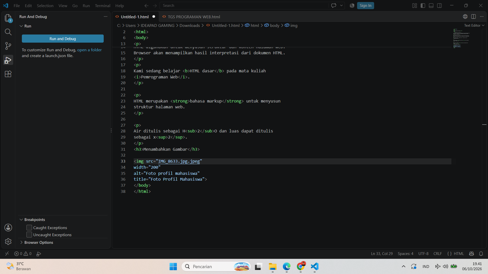
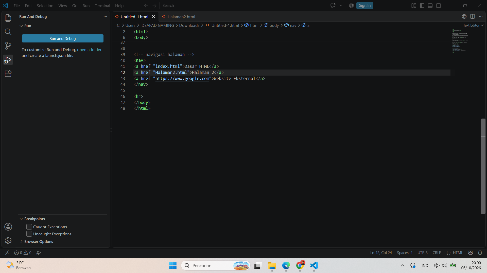
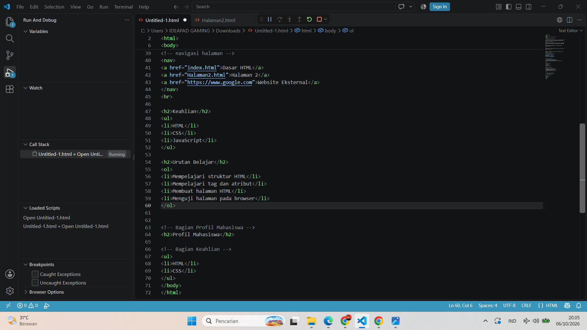
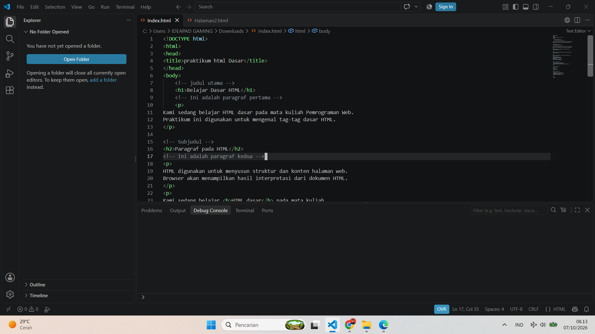
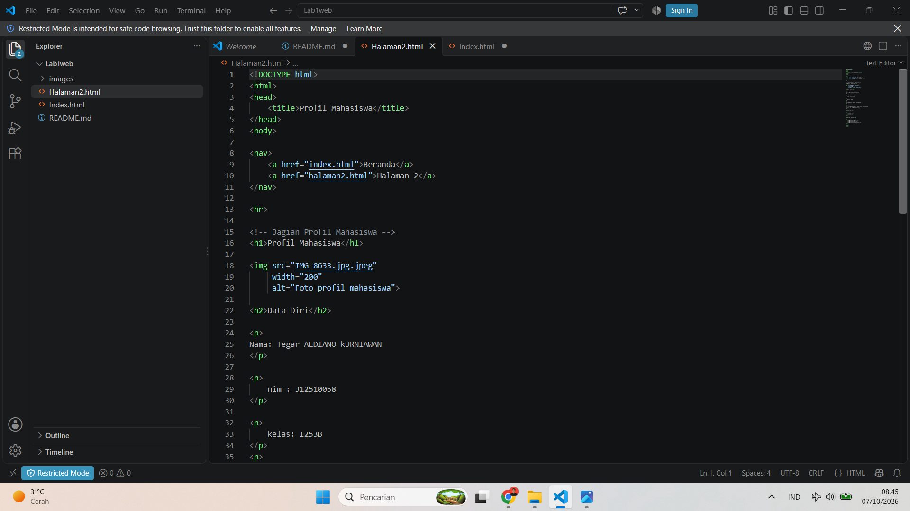

# Praktikum 1 - HTML Dasar

## Identitas Mahasiswa

**Nama:** Tegar Aldiano Kurniawan  
**NIM:** 312510058  
**Kelas:** I253B  
**Mata Kuliah:** Pemrograman Web

## Tujuan Praktikum

Praktikum ini bertujuan untuk:

1. Memahami struktur dasar HTML.
2. Memahami tag-tag dasar HTML.
3. Membuat dokumen HTML.

## 1. Membuat Struktur Dasar HTML

Pada tahap pertama saya membuat file Index.html menggunakan Visual Studio Code.
Saya membuat struktur dasar HTML yang terdiri dari html, head, title, dan body.

### Screenshot

## 2. Membuat Paragraf

Pada tahap ini saya menambahkan paragraf menggunakan tag 
.

### Screenshot

## 3. Menambahkan Heading

Pada tahap ini saya menambahkan judul dan subjudul
menggunakan tag <h1> dan <h2>.

### Screenshot

## 4. Memformat Teks

Pada tahap ini saya mencoba beberapa tag untuk memformat teks
seperti <b>, <i>, <strong>, <mark>, , dan .

### Screenshot

## 5. Menyisipkan Gambar

Pada tahap ini saya menambahkan gambar menggunakan tag 
dan menyimpan gambar di dalam folder images.

### Screenshot

## 6. Menambahkan Hyperlink

Pada tahap ini saya membuat hyperlink menggunakan tag <a>
untuk berpindah ke halaman lain dan website eksternal.

### Screenshot

## 7. Menambahkan List

Pada tahap ini saya membuat unordered list menggunakan <ul>
dan ordered list menggunakan <ol>.

### Screenshot

## 8. Menambahkan Komentar

Pada tahap ini saya menambahkan komentar HTML menggunakan format
<!-- komentar -->.

Komentar digunakan sebagai penanda pada bagian kode
dan tidak ditampilkan pada browser.

### Screenshot

## 9. Membuat Halaman Kedua

Pada tahap ini saya membuat file Halaman2.html dan
menghubungkannya dengan Index.html menggunakan hyperlink.

### Screenshot

## Kesimpulan

Dari praktikum ini saya mempelajari dasar-dasar HTML,
mulai dari struktur dokumen HTML, heading, paragraf,
format teks, gambar, hyperlink, list, komentar,
dan pembuatan halaman HTML kedua.